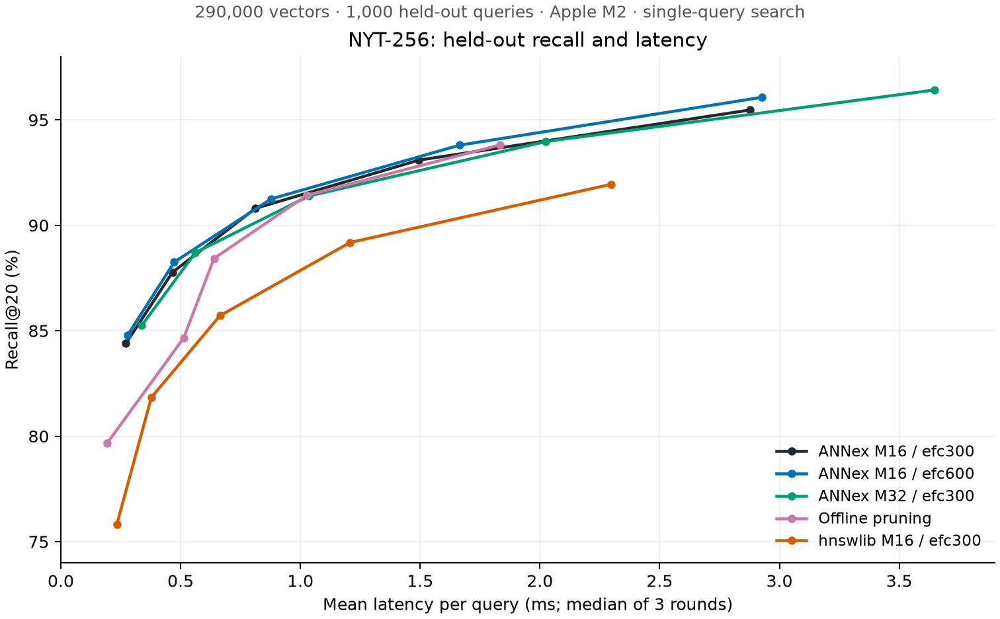

# NYT recall and latency investigation — 2026-09-14

The results below are measured on the full 290,000-vector, 256-dimensional NYTimes dataset. The cache-only patch (`618b842`, PR #2) avoids scanning all deletion flags on every query. Graph experiments are opt-in benchmark code and do not modify the saved snapshots. The tables in the first sections predate the later patience-default and triangle-inequality commits; they are not measurements of those newer changes.

## Method

Apple M2, 16 GiB RAM, Rust 1.92.0 release builds. Top-k is 20. Exploration used queries 0–999; validation used queries 1000–1999. Each ANNex configuration receives an untimed warm-up and recall/counter pass, followed by three timed rounds of single-query `search_with_options` calls. Tables show the median of the three round means and the median of their p99s, not a pooled p99. Recall is computed outside timing. Every warm-up checks equality of result IDs between ordinary and statistics-enabled searches.

All ANNex rows below use the deletion-count cache, early-exit patience 2, and no triangle-inequality skip. The baseline is repeated after the other runs to reduce sensitivity to machine conditions. Timed workloads ran sequentially after builds/tests finished. Laptop timings still vary; the original exploration had some latency spikes. Build times are not compared because builds overlapped other work. There is one independently randomized ANNex build per configuration, so small recall differences include possible graph-construction variation. This is evidence for next experiments, not a statistically established global optimum.

An independent exact cosine check on 40 evenly spaced queries matched 797/800 supplied labels. The three mismatches were ties at the top-20 boundary with zero float32 similarity gap. The ground truth does not explain the approximate-search recall gap.

## Construction quality and connectivity

The original graph uses M=16, M0=32, stored L0 cap=128, ef_construct=300. The efc600 graph changes ef_construct to 600. The higher-connectivity graph changes both M to 32 and M0 to 64, retaining ef_construct=300 and stored L0 cap=128. All builds inherited the NYT construction scan cap of 64. These are full rebuilds, saved to separate files.

The following are held-out results, using scan cap 64:

| Configuration | ef_search | Recall@20 | Mean latency (ms) | p99 (ms) |
|---|---:|---:|---:|---:|
| M16 / efc300 | 64 | 87.77% | 0.466 | 0.812 |
| M16 / efc300 | 128 | 90.80% | 0.812 | 1.275 |
| M16 / efc300 | 256 | 93.09% | 1.495 | 2.080 |
| M16 / efc300 | 512 | 95.47% | 2.877 | 4.074 |
| M16 / efc600 | 64 | 88.25% | 0.473 | 0.815 |
| M16 / efc600 | 128 | 91.25% | 0.878 | 1.314 |
| M16 / efc600 | 256 | 93.80% | 1.665 | 3.404 |
| M16 / efc600 | 512 | 96.07% | 2.928 | 4.111 |
| M32 / M0=64 / efc300 | 64 | 88.70% | 0.562 | 0.968 |
| M32 / M0=64 / efc300 | 128 | 91.39% | 1.036 | 1.641 |
| M32 / M0=64 / efc300 | 256 | 93.97% | 2.025 | 3.140 |
| M32 / M0=64 / efc300 | 512 | 96.41% | 3.647 | 4.714 |

## Query and graph experiments

- Scan caps 32, 64, 128, and unlimited: larger scans gain some recall but spend more time per expansion. A smaller scan with a larger ef is often a similar tradeoff, not a free win.
- Four entry seeds: only a small recall change in the exploratory sweep (at ef=64, 88.55% to roughly 88.7%). No large gain demonstrated.
- Expansion multiplier 4: essentially unchanged exploratory recall; increasing this cap is not a promising default change.
- Early-exit patience 0: reduced low-ef recall, with little reason to replace the baseline value of 2.
- Diverse edges first: reorder existing L0 links by the HNSW diversity heuristic, then retain the remaining links. The 32-edge scan recovered some recall but used more distance computations; the 64-edge scan barely changed. No consistent overall win.
- Offline diversity pruning: retain only the heuristic-selected edges (up to 32), without filling the list with rejected nearest neighbors. This is an experimental graph, not a production setting. See the table and curve for its recall cost and latency.

| Configuration | ef_search | Recall@20 | Mean latency (ms) | p99 (ms) |
|---|---:|---:|---:|---:|
| M16 / efc300 | 64 | 87.77% | 0.466 | 0.812 |
| M16 / efc300 | 128 | 90.80% | 0.812 | 1.275 |
| M16 / efc300 | 256 | 93.09% | 1.495 | 2.080 |
| Offline diversity pruning | 64 | 84.66% | 0.513 | 2.335 |
| Offline diversity pruning | 128 | 88.42% | 0.639 | 1.520 |
| Offline diversity pruning | 256 | 91.42% | 1.027 | 1.510 |



## Production change: constant-time deletion count

`HNSWIndex::deleted_count()` previously scanned the entire deletion array, including on every unfiltered query. It now reads a maintained count. Deletions increment it only once; loading a snapshot reconstructs it from flags. The serialized snapshot format is unchanged.

Three alternating before/after runs of the existing statistics-enabled NYT harness on the exact same original snapshot showed median throughput improvements of 7.6%, 3.7%, 2.8%, 1.4%, and 0.1% at ef=32/64/128/256/512 respectively, with unchanged reported recall. The gain matters most for short queries and scales with collection size; it does not improve recall itself.

Cache-only validation: 71 ordinary tests passed; 24 opt-in tests were skipped in the ordinary suite. Formatting, clippy (existing warnings), and docs checks passed. The new regression covers duplicate/unknown deletions, snapshot restore, insertion after restore, and deleting all points. Opt-in frontier experiments run separately and compare the two search APIs query by query.

## Reference implementation

hnswlib 0.8.0, cosine, M=16, ef_construction=300, seed=42, built with four threads. Search uses one thread and one query per Python call, with untimed warm-up/recall and three timed rounds. Its standard M0=32 storage differs from ANNex's stored cap of 128. Python overhead, graph memory, build algorithms, and randomization differ, so this is a reference configuration comparison, not an equal-graph or equal-memory engine ranking.

Held-out reference results:

| Configuration | ef_search | Recall@20 | Mean latency (ms) | p99 (ms) |
|---|---:|---:|---:|---:|
| hnswlib M16 / efc300 | 64 | 81.84% | 0.378 | 0.658 |
| hnswlib M16 / efc300 | 128 | 85.72% | 0.664 | 1.050 |
| hnswlib M16 / efc300 | 256 | 89.19% | 1.207 | 1.771 |
| hnswlib M16 / efc300 | 512 | 91.94% | 2.298 | 3.156 |

## What to investigate next

1. **Make parallel graph updates preserve concurrent writes.** In `search_and_link`, a node's new neighbor list replaces its current list, which may already contain reverse edges written by another thread. The prior parallel pruning path also cloned under a read lock and later replaced under a write lock; the corrective patch now holds the destination lock throughout pruning. Initial node-list replacement still needs a merge that preserves existing reverse edges, with deduplication and deterministic interleaving tests. This is a code-level lost-update finding; its contribution to measured recall has not been isolated. hnswlib holds the destination lock through reciprocal-edge insertion and pruning. [Source](https://github.com/nmslib/hnswlib/blob/master/hnswlib/hnswalg.h)

2. **Separate build-time traversal from query shortcuts, then tune connectivity and pruning together.** Both insertion paths inherit the global neighbor scan cap from query configuration. Increasing ef_construct still searches only a prefix of each adjacency list. Compare uncapped construction against cap=64 at fixed seeded graph parameters. Also test compact storage and avoiding unconditional refill after diversity selection. hnswlib selects up to M outgoing neighbors and caps reciprocal L0 lists at 2M; ANNex currently fills to M0 and stores up to 128. These are different graph policies, not just different ef values. Higher M and construction effort are established tuning dimensions, but their gains saturate. [Parameter guidance](https://github.com/nmslib/hnswlib/blob/master/ALGO_PARAMS.md)

3. **Add a compact immutable search representation.** Store adjacency with 32-bit internal IDs and contiguous offsets, and remove per-node locks for explicitly frozen snapshots. ANNex currently follows a `RwLock<Vec<usize>>` for every expansion. Reorder physical node/vector placement to improve locality while preserving public point IDs and graph edges. This can target latency without approximation error, but no speedup is measured here. Cache-aware graph reordering has prior research support. [Paper](https://arxiv.org/abs/2104.03221)

4. **Prototype reduced-precision traversal plus float32 reranking.** FP16/BF16 or int8 storage can reduce vector memory traffic; use full-precision originals to rerank an overfetched candidate set. Reranking corrects candidate ordering errors but cannot recover neighbors never visited. Quantized traversal therefore needs matched-recall evaluation on held-out queries. USearch supports several reduced-precision storage formats. [Documentation](https://github.com/unum-cloud/USearch/blob/main/python/README.md)

5. **Resume adaptive searches instead of restarting.** The current adaptive path reruns L0 from the entry seeds, repeating work already done. Preserve the frontier and visited state when increasing ef. Calibrate the trigger using held-out recall and distance/candidate-gap signals; the current best-score threshold alone is not evidence of low recall. Batched distance kernels and prefetch-distance tuning are additional latency experiments after measuring where search time goes.

## Reproduction and artifacts

Machine-readable medians: [recall-investigation-results.json](recall-investigation-results.json). Local raw logs: `logs/recall-investigation/`. Experimental snapshots are ignored by git and remain in `data/nytimes-256-angular/`.

```sh
# Warmed ANNex frontier (default: original snapshot, queries 0–999, 3 rounds).
VECTORDB_EARLY_EXIT_PATIENCE=2 VECTORDB_TI_SKIP=0 cargo test --release --test nytimes_frontier nytimes_warmed_frontier -- --ignored --nocapture

# Held-out slice, scanning 32 and 64 neighbors.
VECTORDB_FRONTIER_OFFSET=1000 VECTORDB_FRONTIER_SCANS=32,64 \
  VECTORDB_EARLY_EXIT_PATIENCE=2 VECTORDB_TI_SKIP=0 cargo test --release --test nytimes_frontier nytimes_warmed_frontier -- --ignored --nocapture

# Optional experiment selectors:
# VECTORDB_FRONTIER_ORDER=diverse or pruned (default: original)
# VECTORDB_NYT_PERSIST_PATH=data/nytimes-256-angular/investigation_efc600.bin
# VECTORDB_NYT_PERSIST_PATH=data/nytimes-256-angular/investigation_m32_m064_efc300.bin

# Separate full rebuild; preserves the original snapshot.
VECTORDB_NYT_EF_CONSTRUCT=600 \
VECTORDB_NYT_PERSIST_PATH=data/nytimes-256-angular/investigation_efc600.bin \
VECTORDB_INSERT_PROGRESS_EVERY=20000 \
  cargo test --release --test nytimes nytimes_build_and_persist_snapshot_only -- --ignored --nocapture
# Higher connectivity: set M=32, M0=64, ef_construct=300 with VECTORDB_NYT_* vars
# and select a different output snapshot path.

# Optional isolated reference environment; not a project dependency.
python3 -m venv /tmp/annex-reference-env
/tmp/annex-reference-env/bin/pip install numpy hnswlib==0.8.0
/tmp/annex-reference-env/bin/python scripts/benchmark_hnswlib_reference.py --build-only
/tmp/annex-reference-env/bin/python scripts/benchmark_hnswlib_reference.py
```

## Review of subsequent local changes

PR #1 (prefetching) is merged. PR #2's cache-only commit `618b842` passed GitHub CI. The subsequent local commits added calibration tests, changed patience to 3, and added optional TI skipping. The five-task plan's larger speed/recall targets are goals, not measured results; RCM, SQ8, and LID insertion have not been implemented here.

The TI implementation needed a correctness correction: raw `1 - cosine` does not satisfy the triangle inequality. A five-node regression reproduced a missed improving neighbor: the incorrect bound returned IDs `[2, 3]` instead of `[2, 4]`. The corrected bound uses square-root (chord) distances and widens for float32 roundoff. Both scan paths and the statistics API now pass the counterexample, and the previous test requires full result equality rather than permitting 20% loss.

Edge caches are now lazy. Normal insertion and snapshot loading leave them empty; the first TI-enabled search fills them under the adjacency read lock. Neighbor updates invalidate them while holding the adjacency write lock. Parallel pruning holds that write lock throughout selection and replacement, avoiding its prior lost-update window. A regression covers disabled-path laziness, snapshot restoration, concurrent cache initialization, and invalidation on adjacency changes, including unchanged-length updates.

The recorded patience calibration ran at debug-level throughput and cannot substantiate the claimed 16% release speedup. The source comment no longer makes that claim. A release-mode comparison of patience 2/3 and corrected TI is kept separate from the historical construction tables above.
